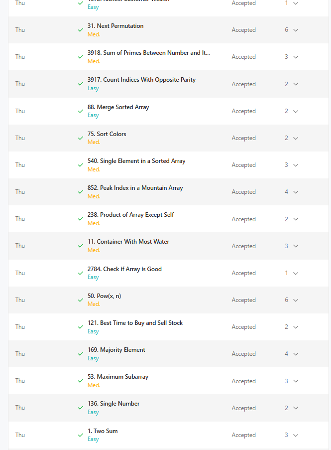
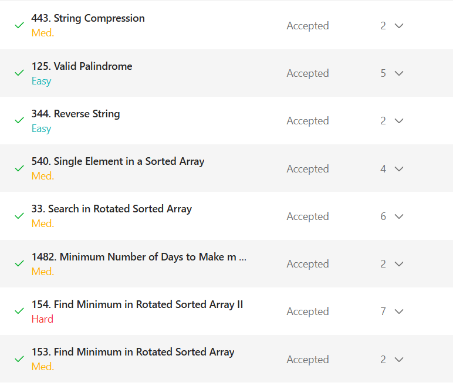
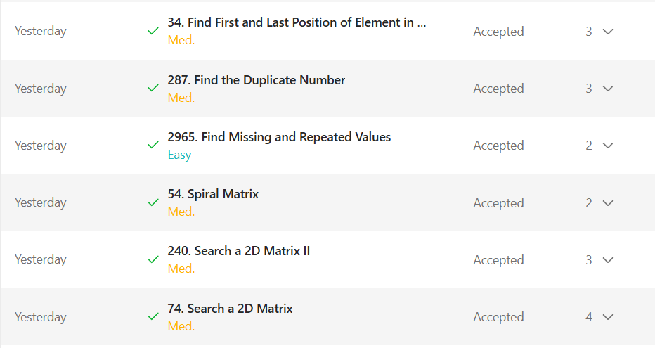
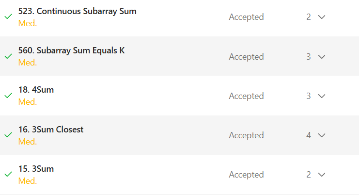

# 👋 Welcome to Vision CSE  

This repository is for the **15 Days of Code Challenge** organized by **Vision CSE** 🚀  

## 📌 About the Challenge
- Duration: **2 phases of 15 Days**
- Goal: Code every day and build consistency  
- Task: Fork this repository, and update your progress here!  

## ✅ How to Participate
1. **Fork** this repository.  
2. **Edit this README** file in your fork.  
3. Document your progress daily:  
   - Add a short note on what you did  
   - Attach screenshots or  
   - Add links to your code submissions/projects  
4. Keep pushing your changes every day!  

# Daily Progress Tracker

## Day 1

### Progress Update
Today I revised coding problems that I had already been through, solved qotd, and learned how to use GitHub repositories with VS Code.

### Screenshot

### Key Learnings
- Cloning repositories
- Updating README files
- Uploading images to GitHub
- Using git add, commit, and push
- Revised concepts of array transition and binary search.

## Day 2

### Progress Update
Today I revised a few more coding problems based on binary search and also revised strings. Also solved the question of the day.

### Screenshot

### Key Learnings
- Revised concepts of array transition and binary search.
- Revised search in rotated sorted array.
- Revised basic problems of strings and palindromes.

## Day 3

### Progress Update
Today I revised 2-D arrays and solved problems based on two pointers and binary search.

### Screenshot

### Key Learnings
- Revised concepts of 2-D array transition and binary search.
- Solved searh problems in 2-D array.

## Day 4

### Progress Update
Today I sloved higher level problems including those involving preifx sum, hashmap, and two pointers.

### Screenshot

### Key Learnings
- Revised prefix sum and its concepts.
- Solved standard problems including 3sum and 4sum.

## Day 5

### Progress Update
Today I solved higher level problems based on previously learnt concepts and virtually attended LC weekly contest 502 and was able to solve the first two problems

### Screenshot

### Key Learnings
- solved higher level binary search problems.
- virtually attended conest and solved two problems(1 easy and 1 medium).